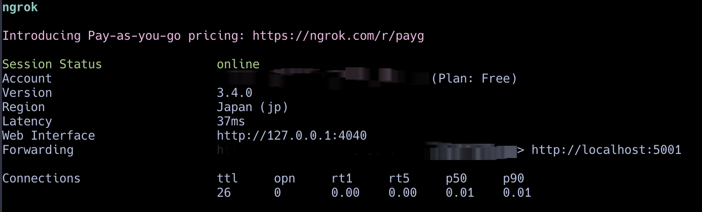

## 项目结构
```
├── README.md
├── config
│   └── base_settings.py
├── main.py
├── requirements.txt
└── utils
    └── chatgpt.py
```


## 实现功能
 - 接入GPT-3.5-Turbo模型
 - 机器人对话响应
 
 - loguru日志记录

## 搭建教程
 - 测试时可以使用ngrok进行内网穿透
 
